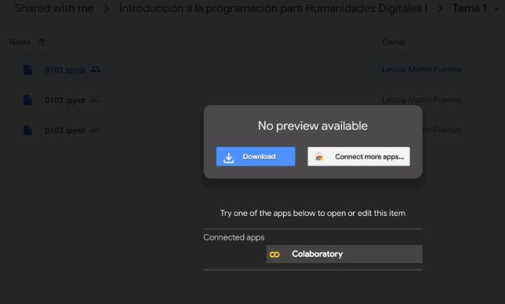

# Introducción a la programación para humanistas
## Bienvenida
¡Hola! En este curso vamos a aprender a programar y, para ello, vamos a usar Python.

Este curso corresponde a las asignaturas Introducción a la programación para Humanidades Digitales I y II del [máster en Tecnologías de la Información para la Sociedad Digital: Humanidades y Ciencia](https://formacionpermanente.uned.es/tp_actividad/idactividad/10908) de la UNED. Para contextualizar un poco de dónde sale todo esto, puedes leer [esta entrada](https://medium.com/@nimbusaeta/libero-mis-materiales-19ca6a1ce1a0).

En este README encontrarás algunas cuestiones prácticas:

- [Por qué un curso de programación para humanistas](#por-qué-un-curso-de-programación-para-humanistas)
- [Contenidos](#contenidos)
    * [Nomenclatura de los temas y ejercicios](#nomenclatura-de-los-temas-y-ejercicios)
- [Cuadernos Jupyter](#cuadernos-jupyter)
- [Dudas](#dudas)

## Por qué un curso de programación para humanistas
Hoy en día cualquier persona puede sacarle un provecho tanto personal como profesional a la habilidad de programar. Los lenguajes de programación se han vuelto tan versátiles y están tan presentes en tantas profesiones que el desafío es más bien pensar en sus límites. El campo de las [humanidades digitales](https://es.wikipedia.org/wiki/Humanidades_digitales) no es una excepción y cada vez somos más los que desafiamos la división férrea entre letras y ciencias.

Ahora bien, ¿por qué es necesario un curso _especialmente_ dedicado a humanistas? Porque los que hay suelen partir de que los alumnos ya saben programar en otros lenguajes o que si se están acercando a la programación es porque les interesan las matemáticas, la lógica, etc. Y ya hay muchos más perfiles distintos a ese que se acercan a la programación y sienten rechazo ante unos materiales que no empatiza con ellos. En realidad, ni siquiera es rechazo, es sensación de que eso no es para ellos, que no encajan ahí.

Por eso, este curso contextualiza cada término, explica cada concepto desde cero, pone ejemplos y ejercicios con literatura, hace hincapié en los métodos de las strings, se adelanta a posibles errores comunes y se adentra un poquito en el procesamiento del lenguaje natural con NLTK.

## Contenidos
En cada tema veremos una funcionalidad distinta de Python. Cada tema consta de 3 a 5 cuadernos o secciones en los que se trata alguna funcionalidad o concepto concreto. A continuación se enlaza el primer cuaderno de cada tema:
- [Tema 1: calentando motores](Cuadernos/0101.ipynb)
- [Tema 2: variables](Cuadernos/0201.ipynb)
- [Tema 3: objetos y métodos](Cuadernos/0301.ipynb)
- [Tema 4: condiciones](Cuadernos/0401.ipynb)
- [Tema 5: estructuras de datos](Cuadernos/0501.ipynb)
- [Tema 6: bucles](Cuadernos/0601.ipynb)
- [Tema 7: funciones](Cuadernos/0701.ipynb)
- [Tema 8: ficheros y módulos](Cuadernos/0801.ipynb)
- [Tema 9: expresiones regulares](Cuadernos/0901.ipynb)
- [Tema 10: NLTK](Cuadernos/1001.ipynb)

### Nomenclatura de los temas y ejercicios
Los temas están numerados de la siguiente forma:
- 0101 - tema 1, cuaderno 1
- 0102 - tema 1, cuaderno 2
- 0201 - tema 2, cuaderno 1
- Etc.

Además, los ejercicios que hay al final de cada cuaderno llevan la siguiente nomenclatura:
- 010101 - tema 1, cuaderno 1, ejercicio 1
- 010102 - tema 1, cuaderno 1, ejercicio 2
- 010201 - tema 1, cuaderno 2, ejercicio 1
- 020101 - tema 2, cuaderno 1, ejercicio 1
- Etc.

## Cuadernos Jupyter
Para programar normalmente se necesita tener instalado un entorno de programación. Te animo a instalar Python y usarlo en la terminal, pero si por cualquier motivo (problemas para instalarlo, o quizá todavía no sabes si vas a programar mucho, etc.) no quieres hacerlo ahora, hay un plan B: echar mano de los cuadernos Jupyter (o _Jupyter notebooks_), un tipo de archivos que permiten mezclar texto con código. Este tipo de cuadernos es el formato en el que se encuentran los materiales del curso, para que usarlos sea lo más fácil para ti, tanto si instalas Python como si no. Ya verás que usarlos es muy intuitivo.

Los cuadernos Jupyter son ficheros con extensión .ipynb que pueden abrirse de múltiples maneras:
- Aplicación de Jupyter Notebook.
    * Para instalarla:
        + Sigue los [pasos para instalar Python](Cuadernos/0102.ipynb) y después escribe en la terminal `pip install jupyterlab` para instalar la aplicación.
        + Si lo que tienes instalado es Anaconda, ya cuentas con la aplicación de Jupyter Notebook y no tienes que instalar nada más.
    * Para usarla: cada vez que quieras abrir un cuaderno Jupyter, tienes que ejecutar primero en la terminal `jupyter notebook`. La primera vez tienes que seguir el paso que te indica (entrar en una URL que contiene tu contraseña); las demás veces puedes simplemente ignorar la terminal y usar los cuadernos en el navegador, donde se habrá abierto una pestaña con el directorio correspondiente a tu usuario en el ordenador. Ya solo tienes que navegar entre los directorios para abrir los cuadernos que quieras.
- Google Colaboratory: si tienes una cuenta de Google, esta es la opción más fácil. Solo tienes que descargarte todos los archivos de la carpeta Cuadernos y añadirlos a tu Drive. Después, entra en un cuaderno, como entras en cualquier otro documento de Drive (haciendo doble click o seleccionando y pulsando Enter) y se te abrirá un diálogo como el de la siguiente imagen. Pulsa abajo en Colaboratory y se te abrirá abrir el cuaderno.

## Dudas
Durante el desarrollo del curso, al leer los materiales o intentar hacer los ejercicios, es natural que te surjan dudas. Yo te animo a que cualquier duda o sugerencia que tengas, por extraña que te parezca, la plantees en alguna comunidad, que están para eso. Por ejemplo, en [Lingwars](https://twitter.com/lingwars) estamos tanto humanistas como programadores dispuestos a ayudarte. En su Slack he creado un canal (#dudas-python) para hablar específicamente de este curso (puedes pedir acceso escribiendo a lingwars [arroba] gmail [punto] com). También tienes a [PyLadies](https://twitter.com/PyLadies_ES), que son expertas en Python.

Asimismo, si crees que hay algún error, crea un issue o házmelo saber de alguna forma, para beneficio de todos :)

